# Singularis Beta v3 - AGI System Architecture

This document provides a comprehensive architectural overview of the Singularis AGI coordination system.

## System Architecture Diagram

```mermaid
flowchart TD

%% =====================
%% TOP-LEVEL SYSTEM MAP
%% =====================

subgraph S[Singularis Beta v3 - AGI Coordination System]

    subgraph INIT[Initialization & Configuration]
        I1[Load config & env]
        I2[Import subsystems]
        I3[Create ActionArbiter]
        I4[Attach GPT-5 / LLM bridge]
        I5[Enable hybrid mode flags]
        I6[Start periodic tasks & metrics]
        I1 --> I2 --> I3 --> I4 --> I5 --> I6
    end

    subgraph PERCEP[Perception & World Model]
        P1[Visual input - Gemini/Qwen-VL]
        P2[Game state parser]
        P3[Symbolic facts & predicates]
        P4[World model & affordances]
        P1 --> P2 --> P3 --> P4
    end

    subgraph GEN[Action Candidate Generators]
        G1[Exploration policy]
        G2[Combat / defense policy]
        G3[Dialogue / quest policy]
        G4[Utility / safety policy]
        G5[RL / curriculum policy]
        G1 --> G5
    end

    subgraph ARB[ActionArbiter Core]
        A0[Action request queue]
        A1[Priority routing<br/>CRITICAL/HIGH/NORMAL/LOW]
        A2[Local scoring & ranking]
        A3[Fast local arbitration]
        A4[GPT-5 delegation trigger]
        A0 --> A1 --> A2 --> A3 --> A4
    end

    subgraph GPT[GPT-5 Hybrid Coordinator]
        GPT1[Check need for GPT-5<br/>conflict, low consensus,<br/>periodic check, temporal issues]
        GPT2[Package context:<br/>state + candidates + history]
        GPT3[Call GPT-5 / Nano<br/>meta-cognitive reasoning]
        GPT4[Parse response<br/>3-strategy parsing]
        GPT5[Return selected action<br/>+ justification]
        GPT1 --> GPT2 --> GPT3 --> GPT4 --> GPT5
    end

    subgraph CONF[Conflict Prevention System]
        C1[Check stuck loops<br/>≥3 cycles, leniency rules]
        C2[Check temporal coherence<br/>thresholds & trends]
        C3[Subsystem disagreement scan]
        C4[Health / safety checks]
        C5[Priority-based override<br/>& preemption rules]
        C1 --> C2 --> C3 --> C4 --> C5
    end

    subgraph BIND[Temporal Binding Engine]
        T1[Create perception–action–outcome binding]
        T2[Track open bindings]
        T3[Detect visual / state similarity<br/>stuck loop detection]
        T4[Measure closure / timeout]
        T5[Compute closure rate & stats]
        T6[Generate binding-based<br/>recommendations & penalties]
        T1 --> T2 --> T3 --> T4 --> T5 --> T6
    end

    subgraph STATE[BeingState & Memory Layer]
        BS1[Ingest subsystem data]
        BS2[Update episodic memory]
        BS3[Update semantic / long-term]
        BS4[Compute data age & freshness]
        BS5[Publish unified state snapshot]
        BS1 --> BS2 --> BS3 --> BS4 --> BS5
    end

    subgraph EXEC[Action Execution Layer]
        E1[Validate action & inputs]
        E2[Map to action schema<br/>Exploration/Combat/Menu/etc.]
        E3[Virtual gamepad API<br/>vgamepad / X360]
        E4[Emit controller events<br/>buttons, sticks, combos]
        E5[Register execution outcome]
        E1 --> E2 --> E3 --> E4 --> E5
    end

    subgraph MON[Monitoring & Metrics]
        M1[Track action stats<br/>success, reject, conflicts]
        M2[Hybrid usage stats<br/>local vs GPT-5 decisions]
        M3[Temporal metrics<br/>closure rate, stuck loops]
        M4[Coherence metrics<br/>global & temporal]
        M5[Checkpoint & autosave<br/>BeingState snapshots]
        M1 --> M2 --> M3 --> M4 --> M5
    end

end

%% High-level wiring between modules
INIT --> PERCEP
PERCEP --> GEN
GEN --> ARB
ARB --> CONF
ARB --> GPT
GPT --> ARB
CONF --> EXEC
EXEC --> BIND
BIND --> STATE
STATE --> ARB
STATE --> GPT
MON --> STATE
EXEC --> MON

%% =====================
%% VERTICAL EXECUTION PIPELINE
%% =====================

subgraph PIPE[Run Cycle: Perception → Decision → Action → Binding → Update]

    RC0[Start cycle]

    RC1[Sense & Update World]
    RC1a[Read game frame & state]
    RC1b[Update world model & affordances]
    RC1 --> RC1a --> RC1b

    RC2[Update BeingState]
    RC2a[Ingest subsystem readings]
    RC2b[Refresh memory & freshness metrics]
    RC2 --> RC2a --> RC2b

    RC3[Generate Action Candidates]
    RC3a[Query policies - explore / combat / dialogue / utility]
    RC3b[Sample 2–3 candidates<br/>with confidence 0.65–0.90]
    RC3 --> RC3a --> RC3b

    RC4[Fast Local Arbitration]
    RC4a[Rank by confidence + priority]
    RC4b[Check simple-case criteria<br/>single candidate, high consensus,<br/>coherence OK, not stuck]
    RC4 --> RC4a --> RC4b

    RC5{Simple case?}
    RC6[Use local decision<br/>no GPT-5]
    RC7[Trigger GPT-5 coordination]

    RC8[GPT-5 Reasoning]
    RC8a[Package context + history]
    RC8b[LLM reasoning & selection]
    RC8c[3-strategy response parsing]
    RC8 --> RC8a --> RC8b --> RC8c

    RC9[Conflict Prevention Pass]
    RC9a[Check stuck loop & temporal coherence]
    RC9b[Check subsystem disagreements]
    RC9c[Apply health & safety gates]
    RC9d[Apply priority overrides /<br/>preemption rules]
    RC9 --> RC9a --> RC9b --> RC9c --> RC9d

    RC10[Validated Action Execution]
    RC10a[Create new temporal binding]
    RC10b[Send action to virtual gamepad]
    RC10c[Observe immediate outcome]
    RC10 --> RC10a --> RC10b --> RC10c

    RC11[Temporal Binding Closure]
    RC11a[Update binding status<br/>success / timeout / loop]
    RC11b[Update closure rate stats]
    RC11c[Emit penalties/rewards<br/>back to policies & arbiter]
    RC11 --> RC11a --> RC11b --> RC11c

    RC12[Update BeingState & Metrics]
    RC12a[Write new snapshot]
    RC12b[Log metrics & checkpoint if needed]
    RC12 --> RC12a --> RC12b

    RC13[Next cycle]

end

%% Connect pipeline stages linearly
RC0 --> RC1 --> RC2 --> RC3 --> RC4 --> RC5
RC5 -->|Yes| RC6 --> RC9
RC5 -->|No| RC7 --> RC8 --> RC9
RC9 --> RC10 --> RC11 --> RC12 --> RC13

%% Tie pipeline to system map for clarity
RC1b --- PERCEP
RC2 --- STATE
RC3 --- GEN
RC4 --- ARB
RC7 --- GPT
RC9 --- CONF
RC10 --- EXEC
RC11 --- BIND
RC12 --- MON
```

## Architecture Overview

### Core Subsystems

#### 1. **Initialization & Configuration**
- Environment setup and configuration loading
- Subsystem initialization and dependency injection
- ActionArbiter instantiation with GPT-5 bridge
- Hybrid mode activation and periodic task scheduling

#### 2. **Perception & World Model**
- Multi-modal visual input (Gemini 2.0 Flash, Qwen3-VL)
- Game state parsing and symbolic fact extraction
- World model maintenance with affordances
- Spatial and semantic reasoning

#### 3. **Action Candidate Generators**
Multiple policy systems generate action candidates:
- **Exploration Policy**: Environmental discovery and navigation
- **Combat/Defense Policy**: Tactical combat decisions
- **Dialogue/Quest Policy**: NPC interaction and quest progression
- **Utility/Safety Policy**: Resource management and survival
- **RL/Curriculum Policy**: Learned behaviors and skill development

#### 4. **ActionArbiter Core**
The central decision-making hub:
- **Action Queue**: Priority-based request management
- **Priority Routing**: CRITICAL → HIGH → NORMAL → LOW
- **Local Scoring**: Fast heuristic-based ranking
- **Fast Arbitration**: Simple-case resolution without LLM
- **GPT-5 Delegation**: Complex decision escalation

#### 5. **GPT-5 Hybrid Coordinator**
Meta-cognitive reasoning layer:
- Conflict detection and resolution triggers
- Context packaging with state and history
- LLM-based strategic reasoning (GPT-5/Nano)
- 3-strategy response parsing
- Justified action selection with reasoning chains

#### 6. **Conflict Prevention System**
Safety and coherence enforcement:
- Stuck loop detection (≥3 cycles with leniency)
- Temporal coherence monitoring
- Subsystem disagreement resolution
- Health and safety validation
- Priority-based overrides and preemption

#### 7. **Temporal Binding Engine**
Action-outcome association tracking:
- Perception–Action–Outcome binding creation
- Open binding lifecycle management
- Visual/state similarity detection for loops
- Closure rate computation and statistics
- Binding-based recommendations and penalties

#### 8. **BeingState & Memory Layer**
Unified state management:
- Multi-subsystem data ingestion
- Episodic memory updates
- Semantic/long-term memory integration
- Data freshness and age tracking
- Snapshot publishing for downstream consumers

#### 9. **Action Execution Layer**
Low-level action implementation:
- Action validation and input sanitization
- Schema mapping (Exploration/Combat/Menu/Stealth layers)
- Virtual gamepad API (vgamepad X360 emulation)
- Controller event emission (buttons, sticks, combos)
- Execution outcome registration

#### 10. **Monitoring & Metrics**
System observability:
- Action statistics (success/reject/conflict rates)
- Hybrid usage tracking (local vs GPT-5 decisions)
- Temporal metrics (closure rate, stuck loops)
- Coherence metrics (global and temporal)
- Checkpointing and BeingState autosave

## Execution Pipeline

### Run Cycle Flow

1. **Sense & Update World**
   - Read game frame and parse state
   - Update world model and affordances

2. **Update BeingState**
   - Ingest subsystem readings
   - Refresh memory and freshness metrics

3. **Generate Action Candidates**
   - Query all policy systems
   - Sample 2-3 candidates with confidence scores (0.65-0.90)

4. **Fast Local Arbitration**
   - Rank by confidence + priority
   - Check simple-case criteria (single candidate, high consensus, coherence OK, not stuck)

5. **Decision Routing**
   - **Simple case**: Use local decision immediately (no GPT-5)
   - **Complex case**: Trigger GPT-5 coordination

6. **GPT-5 Reasoning** (if needed)
   - Package context + history
   - LLM reasoning and selection
   - Parse response with 3-strategy approach

7. **Conflict Prevention Pass**
   - Check stuck loops and temporal coherence
   - Validate subsystem agreements
   - Apply health/safety gates
   - Apply priority overrides and preemption rules

8. **Validated Action Execution**
   - Create temporal binding
   - Send action to virtual gamepad
   - Observe immediate outcome

9. **Temporal Binding Closure**
   - Update binding status (success/timeout/loop)
   - Update closure rate statistics
   - Emit penalties/rewards to policies

10. **Update BeingState & Metrics**
    - Write new state snapshot
    - Log metrics and checkpoint if needed

11. **Next Cycle**

## Key Design Principles

### 1. **Hybrid Intelligence**
- Fast local decisions for simple cases
- LLM reasoning for complex situations
- Adaptive delegation based on context

### 2. **Temporal Coherence**
- Action-outcome binding tracking
- Stuck loop detection and prevention
- Closure rate optimization

### 3. **Multi-Modal Perception**
- Visual understanding (Gemini 2.0, Qwen3-VL)
- Symbolic reasoning integration
- World model maintenance

### 4. **Safety-First Architecture**
- Conflict prevention at multiple levels
- Priority-based preemption
- Health and safety validation gates

### 5. **Observability**
- Comprehensive metrics and logging
- State checkpointing
- Decision audit trails

## Integration Points

### Consciousness Bridge
- Global coherence (𝒞) measurement
- Three Lumina tracking (ℓₒ, ℓₛ, ℓₚ)
- Phi (Φ̂) integration for action evaluation

### Memory Systems
- Episodic: Recent experiences and bindings
- Semantic: Long-term knowledge and patterns
- Working: Active context and affordances

### Learning Systems
- Reinforcement Learning (Q-learning)
- Curriculum progression
- Meta-learning from GPT-5 decisions

---

*Last Updated: November 14, 2025*
*System Version: Beta v3*
